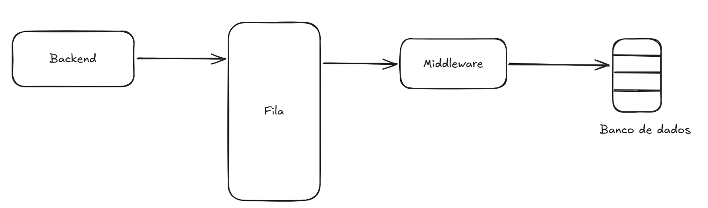
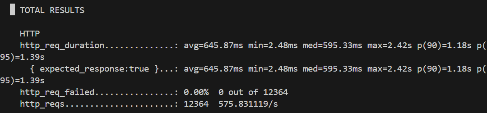
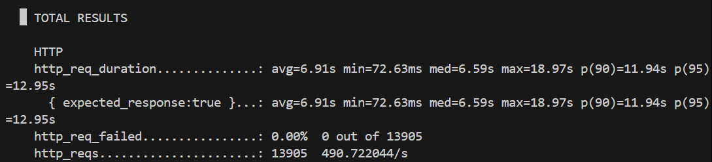
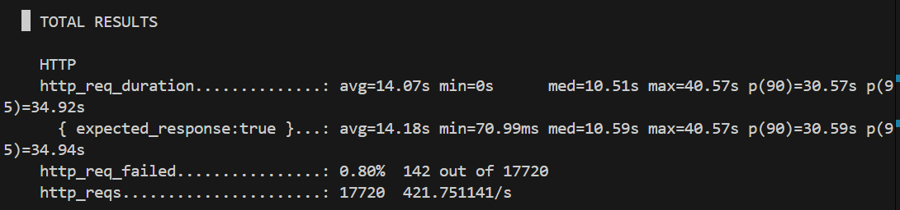

# Uso de filas

## Introdução

&emsp; Este repositório contém uma aplicação baseada na seguinte arquitetura:



&emsp; Trata-se de uma aplicação que trabalha guarda os dados de sensores de maneira assíncrona usando Filas.

As tecnologias utilizadas foram:
- Docker Desktop;
- K6;
- RabbitMQ;

E a linguagem de programação principal foi golang.

Para rodá-la, é necessário a env presente neste arquivo: https://docs.google.com/document/d/1uy-Nk4R9tcWJ7scq-VepKUjac-iNcSdsjafSP_k42js/edit?usp=sharing

&emsp; O objetivo dessa aplicação é aguentar uma alta carga simultânea de requisições. Abaixo, pode-se ver o seu funcionamento e os testes de carga executados.

## Funcionamento

&emsp; Em execução, a aplicação funciona da seguinte maneira.
1. Recebe uma requisição do tipo:

```json
POST /dados-sensores HTTP/1.1
Host: 192.168.96.1:8080
Content-Type: application/json

  {
    "id": "1000006",
    "timestamp": "2026-03-23T23:10:45-03:00",
    "tipo-sensor": "Termistor",
    "tipo-leitura": "analogico",
    "valor": 27.45
  }
```

2. O backend processa essa requisição, enviando-a para uma fila. Se ele conseguiu enviar a requisição com sucesso, retorna 201 e a mensagem "Sua requisição ID_DO_DISPOSITIVO será processada". Caso contrário, retorna o erro

3. A requisição é guardada em uma fila até que possa ser consumida pelo middleware.

4. De maneira assíncrona, o middleware recebe as requisições e as processa: verifica e valida os campos e, então, escreve os dados em um banco de dados

## Testes de Carga

&emsp; Realizou-se três testes de carga usando a biblioteca de JS k6. O primeiro teste foi com 2000 usuários simultâneos enviando requisições para a aplicação durante 20s. Os resultados são mostrados abaixo.



&emsp; Em 20s, os usuários conseguiram enviar 12364 requisições para a aplicação. Neste caso, a aplicação não perdeu nenhum pacote. Portanto, teve plena capacidade de enfileiramento.

&emsp; O segundo teste foi com 5000 usuários simultâneos enviando requisições em 20s. Neste caso, enviou-se 13905 pacotes e as métricas deste teste são apresentadas abaixo.



&emsp; Neste caso, também não houve perda de pacotes.

&emsp; Por último, fez-se o teste com 10000 usuários em 20s. Eles conseguiram enviar 17720 requisições. As métricas dessas requisições são apresentadas abaixo



&emsp; Neste caso, 0.8% ou 142 dos pacotes enviados foram perdidos.

## Especificações

&emsp; Tanto o backend quanto o middleware tiveram acesso à 25% de núcleo de CPU e 128Mb de memória RAM. Já o RabbitMQ teve acesso à 50% de núcleo de CPU e 128Mb de mémoria RAM.

## Discussão dos resultados

&emsp; Observa-se que a arquitetura perdeu pacotes apenas ao se atingir 10000 usuários simultâneos com as especificações acima. Ainda assim, tratou-se de poucos pacotes, o que demonstra a sua capacidade de aguentar uma alta carga mesmo sem serviços robustos como Apache Kafka. Observei, porém, que essa perda de pacotes acontecia apenas no início da alta carga pelo erro: "Connection Refused" do RabbitMQ. Isso demonstra que um possível gargalo na aplicação é a conexão entre backend e fila que, após altos picos, cai.

&emsp; Ademais, como é natural de uma arquitetura assíncrona, a latência e o throughput não se saíram tão bem. A latência no último teste passou, em média, de 10 segundos. Isso acontece porque adicionamos à fila a arquitetura.

## Como rodar a aplicação

1. Com o Docker instalado, adicione o [arquivo env](https://docs.google.com/document/d/1uy-Nk4R9tcWJ7scq-VepKUjac-iNcSdsjafSP_k42js/edit?usp=sharing) na past middleware.

2. Vá até o terminal e rode:

```bash
docker compose up --build
```

3. Mande uma requisição na rota liberada (geralmente ``localhost:8080/dados-sensores``).


